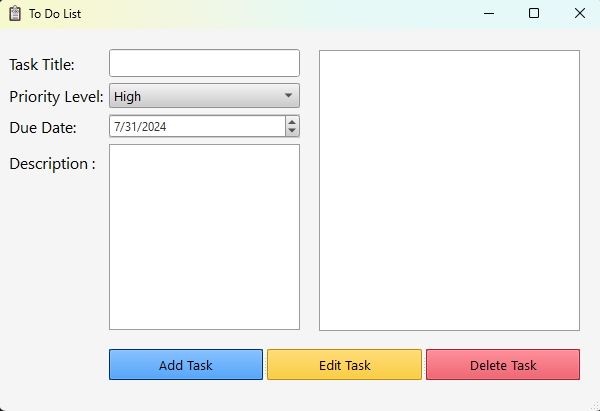
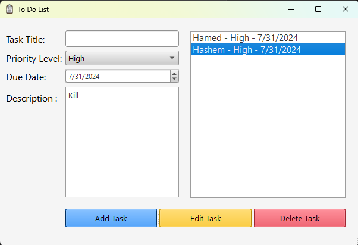

# To-Do List Application


## Description

The **To-Do List Application** is a desktop application built using Python and PyQt5 for managing tasks. It allows users to add, edit, and delete tasks, set priorities, and due dates. Tasks are saved and managed in an SQLite database. This application features a user-friendly graphical interface and is designed to help users stay organized and manage their daily tasks effectively.

## Features

- **Add Tasks**: Create new tasks with a title, priority, due date, and description.
- **Edit Tasks**: Modify existing tasks by updating any of their details.
- **Delete Tasks**: Remove tasks from the list.
- **Task List**: View all tasks in a list with their details.
- **Description Display**: Click on a task to view its description.
- **Default Date**: Due date is set to the current date by default.

## Screenshots

Here are some screenshots of the To-Do List Application:

1. **Main Window:**
---
   

2. **Add/Edit Task Form:**
 ---
   


## Installation

1. Clone the repository:

   ```bash
   git clone https://github.com/Hamed-Gharghi/To-Do-List-Application.git
   ```

2. Navigate to the project directory:

   ```bash
   cd To-Do-List-Application
   ```

3. Install the required Python packages:

   ```bash
   pip install -r requirements.txt
   ```

4. Run the application:

   ```bash
   python main.py
   ```

## Files

- **`main.py`**: The main Python script that runs the application.
- **`To-Do-List.ui`**: The PyQt5 UI file for the application's interface.
- **`icon.png`**: Icon used for the application.
- **`requirements.txt`**: List of Python dependencies.
- **`README.md`**: This README file.

## Usage

- Open the application.
- Use the form on the left to add new tasks with a title, priority, due date, and description.
- Tasks will appear in the list on the right.
- Click on a task in the list to see its description.
- Use the buttons at the bottom to add, edit, or delete tasks.

## License

This project is licensed under the MIT License - see the [LICENSE](LICENSE) file for details.

## Tags

- **Python**: Python
- **PyQt5**: PyQt5, Qt
- **GUI**: Graphical User Interface
- **To-Do List**: To-Do List, Task Manager, Task List
- **SQLite**: SQLite Database
- **Desktop Application**: Desktop App, Desktop Software
- **Open Source**: Open Source, MIT License
- **Task Management**: Task Management System, Personal Organizer
- **Productivity**: Productivity App, Productivity Tools
- **Python Project**: Python Project, Python Application

## Keywords

- Python PyQt5
- To-Do List Application
- Task Management App
- SQLite To-Do List
- Desktop GUI Application
- Task Organizer
- Personal Task Manager
- Open Source Task App

## Author

**Hamed Gharghi**

- Email: [Hamedgharghi1@gmail.com](mailto:Hamedgharghi1@gmail.com)
- GitHub: [Hamed-Gharghi](https://github.com/Hamed-Gharghi)

## Acknowledgements

- PyQt5 documentation for detailed usage and examples.
- SQLite documentation for database integration.
- Contributions and feedback from the open-source community.
